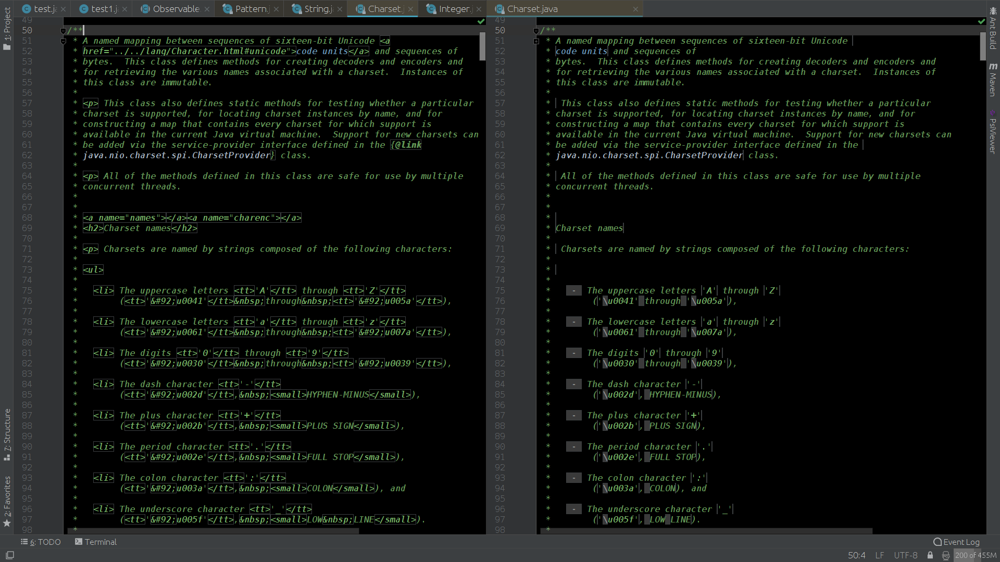
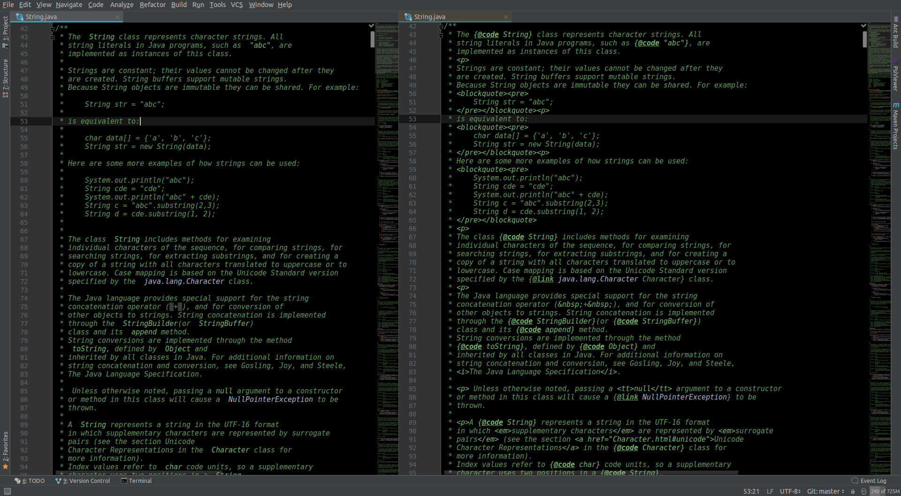
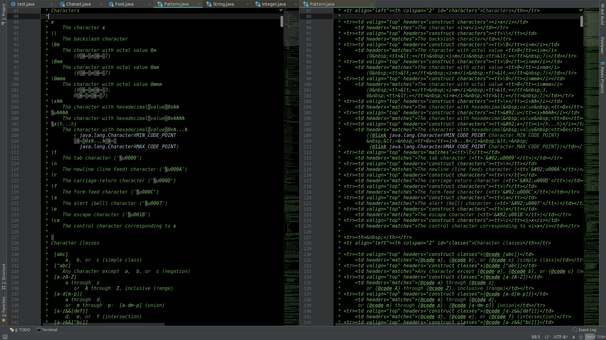

<h2>JavaDoc Clean Read plugin for IntelliJ platform IDEs.</h2>

<h4>Why?</h4>
      HTML and JavaDoc <b>tags</b>, as well as HTML <b>escaped chars</b> make the text of JavaDoc comments <b>hard to read</b> (sometimes almost impossible) in the Code Editor.     
     We can open the quick documentation window (Ctrl+Q or ⌃J or View > Quick Documentation from the menu). But that need additional actions and give the text formatted withing different style then source code. Also links at the JavaDoc comment lead to the source code of linked element, but at the quick documentation window it leads to generated JavaDoc of linked element, which is not what we usually desire. 

<h4>How?</h4>
      <li> Hiding(folding) HTML tags;
      <li> Unescape HTML escaped chars;
      <li> Text styles for value of tags: &lt;code&gt; | &lt;tt&gt; | &lt;li&gt; | &lt;b&gt; | &lt;i&gt; | &lt;a href/name=...&gt; | @code | @literal | @link | @linkplain | @value;
      <li> Tag and tag's value text styles are customisable at Settings -> Editor -> Color Scheme -> JavaDoc Clean Read.

Both HTML-JavaDoc tags hiding and HTML escaped chars unescaping are implemented through IntelliJ <a href="https://www.jetbrains.com/help/idea/code-folding.html">code folding</a>. So all shortcuts (Ctrl+. Ctrl+NumPad + and others) works. As well as <i>code folding toggles</i> (like <code>&#x2302;</code>) shown in the editor to the left of the corresponding multiline folding regions.         

There are some limitations for corner cases in current release: multiline tags (fixed at 0.3.0), nested tags (fixed at 0.3.0), ... But mostly it works fine.  

Side by side comparison of <code>java.nio.charset.Charset</code> and <code>java.lang.String</code> top JavaDoc comment:  

For even more fun see <code>java.util.regex.Pattern</code> ;)  

<h4>Alternatives?</h4>
    I don't know any... :(   Would be glad if JetBrain implements that more proper way as part of IntelliJ platform. 

## **License**

Plugin is open-source software and is licenced under GPL v3 licence.

## **Versions**

0.3.0 - Multi-line Html/Javadoc tag and tag's value support added (all possible cases founded). Also added/fixed:  
    &emsp; - Annotate Html/Javadoc tag and Html Escaped chars (with Bordering effect by default - customisable).  
    &emsp; - Customisation for &lt;b&gt; and &lt;i&gt; tags added.  
    &emsp; - Proper support for both Default and Darcula themes added.  
    &emsp; - fix <a href="https://youtrack.jetbrains.com/issue/IDEA-198738">IDEA-198738</a>.  
    &emsp; - &lt;a name=...&gt; support (and separation from &lt;a href=...&gt;) added.  
    &emsp; - CPU usage and Mem allocation optimisations.  

0.2.2 - Highlight &lt;a href=...&gt; tag value &lt;/a&gt; (customisable).  

0.2.1 - Few improvements:  
    &emsp; - @literal tag support added;  
    &emsp; - text inside @code and @literal is not interpreting as HTML markup;

0.2.0 - Refactoring and covering by tests. Plugin should be more stable and less error prone. Also fixed issues with:  
    &emsp; - Multiline @link and @code tag folding;  
    &emsp; - @linkplain tag added (@link rules applied);  
    &emsp; - Unescaping for not valid escaped chars sequence;  
    &emsp; - Not interpreting the text as HTML markup inside @code tag (&lt;Generics&gt;);  

0.1.0 - Initial release:  
           &emsp; * hiding(folding) HTML tags;  
           &emsp; * unescape HTML escaped chars;  
           &emsp; * text styles for tags: &lt;code&gt; | &lt;tt&gt; | &lt;b&gt; | &lt;i&gt; | @code | @link (fix <a href="https://youtrack.jetbrains.com/issue/IDEA-197760">IDEA-197760</a>).  
